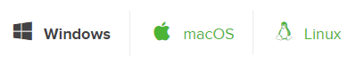
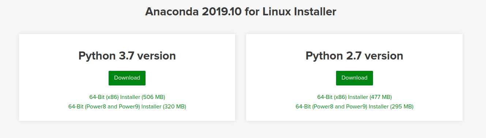
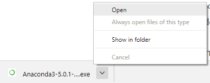
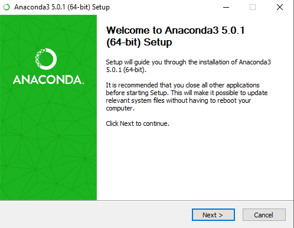
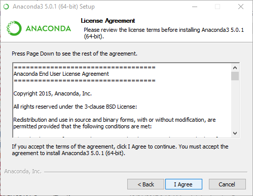
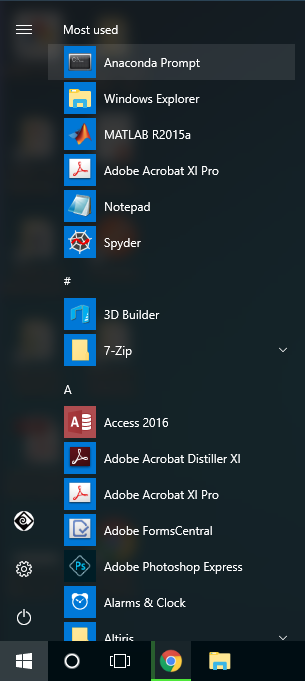

 # Installing Anaconda on Windows

#### Go to the following link: Anaconda.com/downloads

The Anaconda Downloads Page will look something like this:

Select your operating system

Select Windows where the three operating systems are listed.

Download the most recent Python 3 release. At the time of writing, the most recent release is the Python **3.7** Version. Python 2.7 is legacy Python. For problem solvers, select the Python 3.7 version. If you are unsure if your computer is running a 64-bit or 32-bit version of Windows, select 32-bit runs on all systems.

You may be prompted to enter your email. You can still download Anaconda if you click  `No Thanks` button and don't enter your Work email address.

Open and run the installer from the bottom panel of your browser.

At the beginning of the install, you should click Next to start the installation.

Then agree to the license.

At the Advanced Installation Options screen, Its recommended that you DO NOT check "Add Anaconda to my PATH environment variable"

Open the Anaconda Prompt from the Windows start menu after the installation of Anaconda is complete, go to the Windows start menu and search jupyter notebook and select the icon to start the program.

> Be patient as it takes time on first load depending your computer requirements.

.

