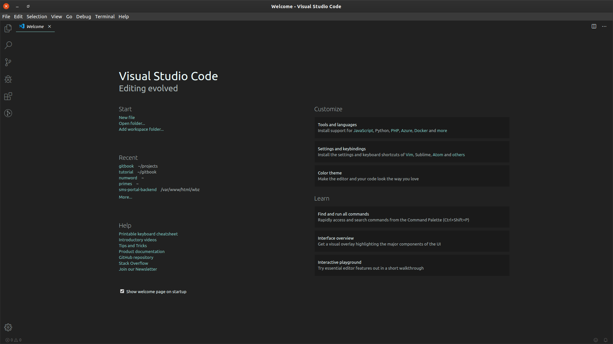
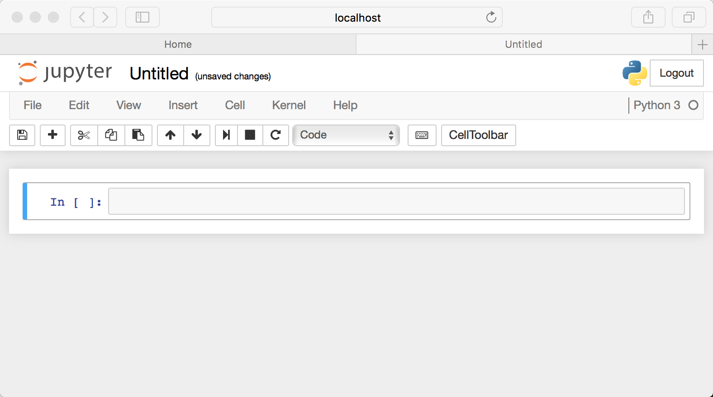
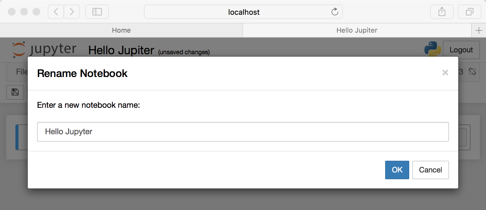
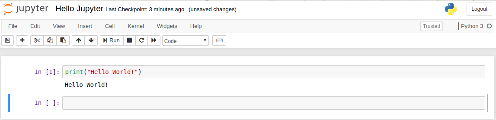

# My First Program 

Once you followed the instructions to install your applications, hurraaaay! your are ready to write your line of code.

At this you should have either Jupyter Notebook or Visual Studio Code (Code Editor) depending on your choice application installed.

If you are using Jupyter Notebook, you should the program launched in your browser as seen below.


Else you should your see Visual Studio Code as below when launched in a window.




## Creating a Notebook

Now that you know how to start a Notebook server, you should probably learn how to create an actually Notebook document.
All you need to do is click on the New button (upper right), and it will open up a list of choices.let’s choose Python 3.

Your web page should now look like this:



## Naming

You will notice that at the top of the page is the word Untitled. This is the title for the page and the name of your Notebook. Since that isn’t a very descriptive name, let’s change it! Just move your mouse over the word Untitled and click on the text. You should now see an in-browser dialog titled Rename Notebook. 

Let’s rename this one to Hello Jupyter:



Running Cells
A Notebook’s cell defaults to using code whenever you first create one, and that cell uses the kernel that you chose when you started your Notebook.
In this case, you started yours with Python 3 as your kernel, so that means you can write Python code in your code cells. Since your initial Notebook has only one empty cell in it, the Notebook can’t really do anything.
Thus, to verify that everything is working as it should, you can add some Python code to the cell and try running its contents.

Let’s try adding the following code to that cell:
```python 
 print('Hello World!')
```
Running a cell means that you will execute the cell’s contents. To execute a cell, you can just select the cell and click the Run button on the row of buttons along the top. It’s towards the middle. 

If you prefer using your keyboard, you can just press Shift+Enter. 
When you ran the code above, the output looked like this:



<!-- HTML generated using hilite.me --><div style="background: #ffffff; overflow:auto;width:auto;border:solid gray;border-width:.1em .1em .1em .8em;padding:.2em .6em;"><pre style="margin: 0; line-height: 125%"><span style="color: #0000DD; font-weight: bold">In [2]:</span><span style="color: #008800; font-weight: bold"> print</span>(<span style="color: red">&#39;hello world!&#39;</span>)<br><br><span style="color: #fd9595; font-weight: bold">Out[2]:</span> hello world!</pre></div><br>

> Instructor should mention that the OUTPUT is the result of their command

