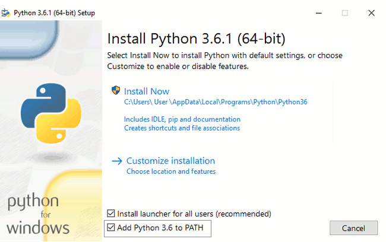

# Install Python: Windows

First check whether your computer is running a 32-bit version or a 64-bit version of Windows, on the "System type" line of the System Info page. To reach this page, try one of these methods:

+ Press the Windows key and Pause/Break key at the same time

+ Open your Control Panel from the Windows menu, then navigate to System &  Security, then System Press the Windows button, then navigate to Settings > System > About

You can download Python for Windows from the website https://www.python.org/downloads/windows/. 

Click on the "Latest Python 3 Release - Python x.x.x" link. If your computer is running a 64-bit version of Windows, download the Windows x86-64 executable installer. Otherwise, download the Windows x86 executable installer. After downloading the installer, you should run it (double-click on it) and follow the instructions there.

> Kindly note: During the installation, you will notice a window marked "Setup". Make sure you tick the "Add Python 3.6 to PATH" or 'Add Python to your environment variables" checkbox and click on "Install Now", as shown here (it may look a bit different if you are installing a different version):

Continue with the installation process with defaults setting and configuration by clicking Next to finish.

When the installation completes, you may see a dialog box with a link you can follow to learn more about Python or about the version you installed. Close or cancel that dialog -- you'll be learning more in this tutorial!

**Note:** if you are using an older version of Windows (7, Vista, or any older version) and the Python 3.6.x installer fails with an error, you can try either:
+ Install all Windows Updates and try to install Python again; or
+ Install an older version of Python, e.g., **3.4.6**

If you install an older version of Python, the installation screen may look a bit different than shown above. Make sure you scroll down to see "Add python.exe to Path", then click the button on the left and pick "Will be installed on local hard drive":

